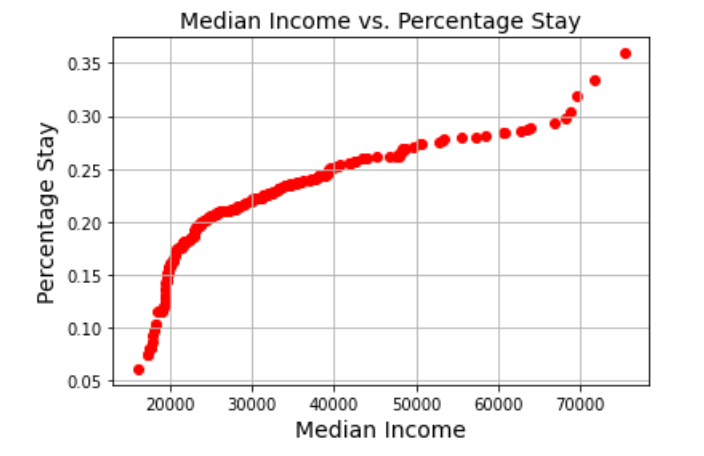
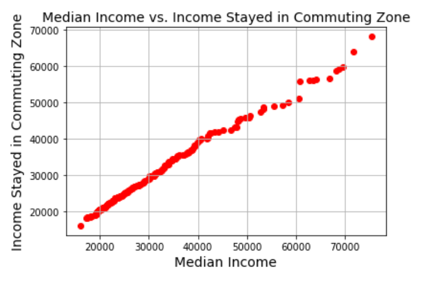
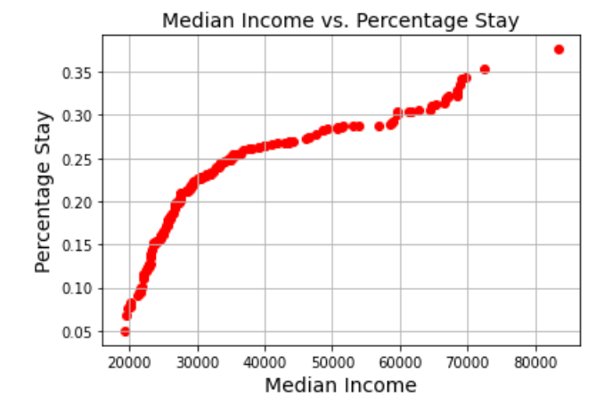
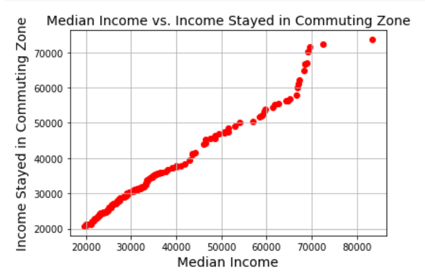
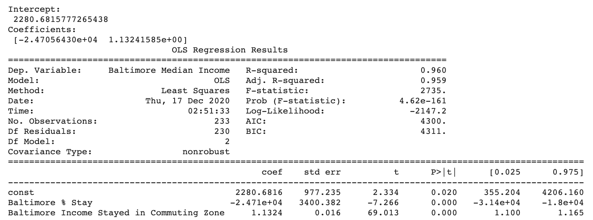
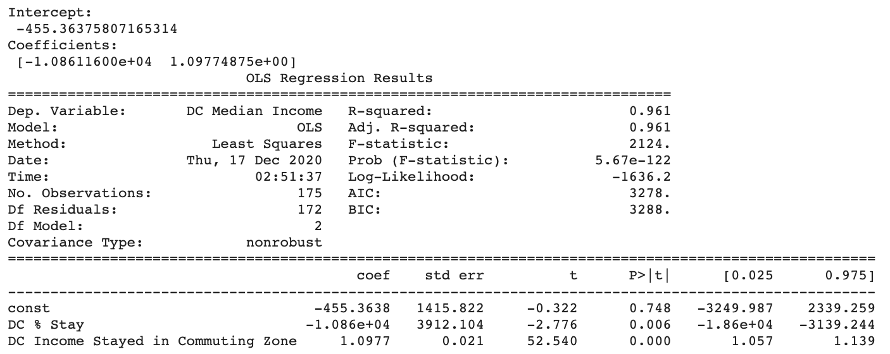

# Comparing Social Mobility in Baltimore and D.C.

## Background
For our final project, my group decided to focus on social metrics in Baltimore and Washington, D.C. in order to compare the viability of social mobility in these two cities. In particular, we focused on two independent variables: the percentage of adults who continue to live in the same neighborhood, and the household income of people who live within their commuting zone. 

Our dependent variable was the median household income of various neighborhoods in Baltimore. By comparing and analyzing these metrics, our goal was to determine if any conclusive observations could be drawn about the restrictions placed upon impoverished residents who are unable to commute to better economic opportunities.  The purpose of this write-up is to summarize and present my contribution to this project – the multiple linear regression.

## Question
For my portion of the final project, I focused on the issue of comparing the effect of the multiple independent variables on the dependent variables. Is it possible to graphically and numerically demonstrate a relationship between multiple data inputs?

## Data Source
All of the data used in this project was gathered from [The Opportunity Atlas](https://www.opportunityatlas.org/). If you would like to view the raw datasets used for this analysis, please see the "Import Data" section of our Google Colaboratory notebook.

## Data Answer
The following data analysis was conducted using Python, in the Google Colaboratory notebook.

## Single Variable Linearity
Before performing the multiple linear regression, I wanted to graphically represent the relationship between each individual independent variable and the dependent variable of median income. I used matplot to create scatter plots, which can be seen below.

### Baltimore, Median Income vs. Percentage Stay

Although this plot does not demonstrate a strict linear relationship, there is still an obvious trend relating the dependent variable to the median income metric. This graph, like the others below, visually demonstrates the viability of including this variable in the multiple linear regression analysis.

### Baltimore, Median Income vs. Income of Workers Living in Commuting Zone

This plot presents a nearly exact linear relationship. This is likely due to the similar population group surveyed in the dependent and independent variable dataset. However, this is still some minor variation in the data.

### DC, Median Income vs. Percentage Stay

Much like the Baltimore graph for this independent variable, the dataset does not exactly adhere to a linear relationship. However, there is a clear trend relating the two metrics.

### DC, Median Income vs. Income of Workers Living in Commuting Zone

This plot, again like the Baltimore graph, shows a nearly linear relationship between the included variables. There is some deviation, but the relationship is clear.

The trends observed in the above single linear regression graphs are indicative of the numerical relevance of each independent variable. Notably, the trends are visually very similar between the two cities, perhaps indicative of a similar relationship.

## Multiple Linear Regression
This section shows the values that resulted out of a multiple linear regression analysis, which was separately performed for both cities' datasets.

#### Baltimore

#### DC

The values above demonstrate the relative importance of each independent variable, and the effect that each has on the median income metric. For both cities, the p-values of the dependent variables are sufficiently small, and the t-values are large enough to indicate that the coefficients present a reliable formula for predicting other independent values.

The numerical relationship for the Baltimore dataset is as follows:
median household income = -24,606(percentage staying in an area) + 1.132(income of people living in their commuting zone) + 2280.68

The numerical relationship for the DC dataset is as follows: -10,861(percentage staying in an area) + 1.098(income of people living in their commuting zone) - 455.36

These equations are indicative of the substantial effect that both metrics have on the dependent variable of average household income.

## Conclusion
This write-up has demonstrated how social metrics can be compared and anaylzed using linear regression. Our group project will go into further detail about the implications of these observations, and how they contribute to our larger business question and answer.
